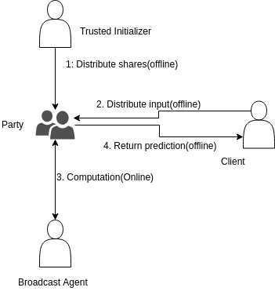

# Lynx: A Framework for Privacy Preserving Machine Learning

Lynx is a framework to do privacy preserving machine learning. It helps the users with sensitive information to apply various machine learning models without other users or the server getting to know any information on the data. This framework uses secure multiparty computation, a field of cryptography where parties compute a mathematical function on the inputs without getting to know the inputs by working on shares of the inputs. The framework uses beavers triples to create a randomization to ensure the security of the data. The framework supports honest-but-curious security model. The architecture looks like follows:


## Prerequisites

The framework uses Java (>=1.8). Ensure that JDK and JRE are installed.

## Installing

To install the framework,

1. Clone the repository to the workspace
2. Build it:
	a) Run make to build and generate the class files
	b) Run make jar to generate class files and create JAR files
3. Four Executable Jar files will be created in the build directory: Party.jar, BA.jar, TI.jar and Client.jar

## Running

The framework needs a machine for the Trusted Initializer, a machine for the Broadcast Agent, and a machine for each party (minimum 2 parties)

In order to run the framework, run the following commands to trigger each process in the respective machines:

 - Trusted Initializer:

The trusted initializer generates the Beavers Triples randomly and distributes the shares to the parties to introduce randomness.

```
java -jar TI.jar <TI-Port> <number of parties> <No. of Integer Triples> <No. of Binary Triples (For bits)> <No. of Big Integer Triples (For real numbers)>
```

 - Broadcast Agent:

The broadcast agent broadcasts the messages received from each party to all the other parties.

```
java -jar BA.jar port=<BA Port> partyCount=<number of parties>
```

 - Party:

The servers that executes the main model:

```
java -jar Party.jar party_port=<Party Port> ti=<TrustedInitializer-IP:TrustedInitializer-Port> ba=<BroadcastAgent-IP:BroadcastAgnet-Port> party_id=<Party-ID> partyCount=<number of parties> model=<model-ID> assymetricBit=<0 or 1 - This value should be 1 for one party and 0 for all the other parties> <All model specific inputs - Refer model specific readme files for details>
```

 - Client:
 
 The data owner that splits the into #Party shares and stores the data in csv files.
 ```
 java -jar Client.jar ShareDistribution partyCount=<number of parties> sourceFile=<input file path> destPath=<output path>
 ```

## Acknowledgments

We would like to thank our professors, who guided us in building this framework.

Professor Martine De Cock, University of Washington, Tacoma
http://faculty.washington.edu/mdecock/

Professor Anderson Nascimento, University of Washington, Tacoma, http://directory.tacoma.uw.edu/employee/andclay

